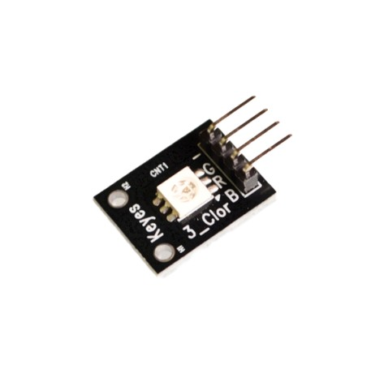
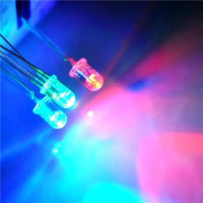

# pxt-rgb-led

- for RGB LEDs
- Support components with pins for R, G, B respectively and a common anode

## Blocks

### Create

Create an RGB LED instance.

Caller provides the pins for R, G, B respectively.

### Show Color

Show color of RGB tuple, each of range 0-255.

## TODO (package)

- [ ] Add a reference for your blocks here
- [x] Add "icon.png" image (300x200) in the root folder
- [ ] Add "- beta" to the GitHub project description if you are still iterating it.
- [ ] Turn on your automated build on https://travis-ci.org
- [ ] Use "pxt bump" to create a tagged release on GitHub
- [ ] Get your package reviewed and approved https://makecode.microbit.org/packages/approval

Read more at https://makecode.microbit.org/packages/build-your-own

## License

MIT

## Supported targets

- for PXT/microbit
